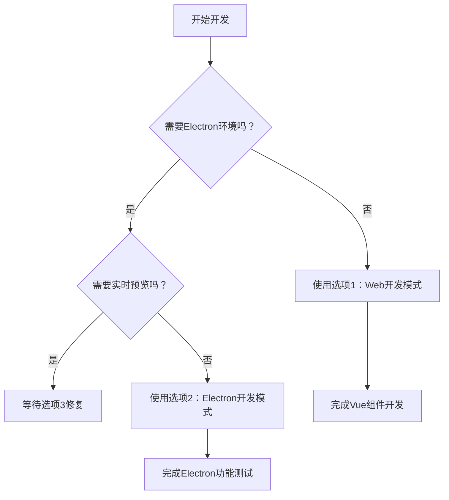

# 开发模式使用指南

## 概述
本项目提供三种开发模式，满足不同开发场景的需求。

## 选项1：Web开发模式 🌐 (推荐用于日常开发)

**执行命令**：
```bash
# 方法1：使用脚本
./dev.sh
# 选择选项1

# 方法2：直接运行
pnpm run dev
```

**特点**：
- ✅ 启动 Vite 开发服务器
- ✅ 访问地址：http://localhost:5173
- ✅ **支持热重载**：修改Vue组件后自动刷新页面
- ✅ **无需重新构建**：保存代码后立即看到变化
- ✅ 开发体验最佳，响应速度快

**适用场景**：
- 95%的Vue组件开发工作
- 页面布局调整
- 样式修改
- 业务逻辑开发
- API接口开发

**不适用场景**：
- Electron桌面功能测试
- 主进程代码开发

---

## 选项2：Electron开发模式 🖥️ (推荐用于功能测试)

**执行命令**：
```bash
# 方法1：使用优化脚本（推荐）
./start-optimized.sh

# 方法2：使用脚本
./dev.sh
# 选择选项2

# 方法3：手动执行
pnpm build --mode electron
electron electron/main.cjs
```

**重要提示**：
- 如果修改代码后重新构建仍显示旧代码，请清理缓存：
  ```bash
  rm -rf dist-electron/
  rm -rf node_modules/.vite/
  pnpm build --mode electron
  ```
- 确保Electron主进程配置正确：应该加载 `dist-electron/index.html` 而不是 `dist/index.html`

**特点**：
- ✅ **完整重新构建**项目到 `dist-electron/` 目录
- ✅ 启动Electron桌面应用
- ✅ 加载静态文件，环境稳定
- ❌ **无热重载**：每次修改代码后需要重新运行脚本
- ❌ 开发效率较低（每次构建需要30秒-几分钟）

**适用场景**：
- 最终的Electron桌面应用测试
- 确认桌面功能正常工作
- 打包前的最终验证
- 测试Electron特定功能（如文件系统、原生菜单等）

**不适用场景**：
- 日常Vue组件开发
- 需要频繁修改代码的场景

---

## 选项3：完整开发模式 🔄 (暂时不可用)

**执行命令**：
```bash
# 方法1：使用脚本
./dev.sh
# 选择选项3

# 方法2：直接运行
pnpm run app:dev
```

**预期特点**：
- ✅ 同时启动开发服务器和Electron应用
- ✅ 支持热重载，Vue组件修改后自动刷新
- ✅ 在Electron环境中实时看到变化

**当前状态**：
- ❌ **暂时不可用**：由于pnpm依赖隔离问题，concurrent执行时环境变量传递失败
- ❌ 这是pnpm的已知限制，不影响核心开发流程

**如果未来修复**：
- 适用于需要Electron环境实时测试的场景
- Electron特定功能开发时的实时预览

---

## 🎯 推荐开发策略

### **日常开发工作流**：

1. **95%时间**：使用 **选项1** (Web开发模式)
   ```
   pnpm run dev
   ```
   - 修改Vue组件 → 自动刷新 → 立即看到效果
   - 开发体验最佳，效率最高

2. **需要Electron测试时**：使用 **选项2** (Electron开发模式)
   ```
   ./start-optimized.sh
   ```
   - 在Electron环境中测试最终效果
   - 确保桌面应用功能正常

3. **选项3**：暂时跳过，等待未来修复

### **开发决策流程**：



### **各模式对比**：

| 特性 | 选项1 (Web) | 选项2 (Electron) | 选项3 (完整) |
|------|-------------|------------------|--------------|
| 热重载 | ✅ 支持 | ❌ 不支持 | ✅ 支持 |
| 构建速度 | ⚡ 即时 | 🐢 慢 (30秒+) | ⚡ 即时 |
| 开发环境 | 浏览器 | Electron桌面 | Electron桌面 |
| 适用场景 | 日常开发 | 最终测试 | 实时预览 |
| 稳定性 | ✅ 稳定 | ✅ 稳定 | ❌ 当前不可用 |
| 推荐使用 | 95% | 5% | 0% |

---

## 📝 常见问题

### **Q: 为什么选项3不可用？**
A: 由于pnpm的依赖隔离机制，concurrent执行时NODE_PATH环境变量无法正确传递，导致electron模块解析失败。这是pnpm的已知限制。

### **Q: 一定要用pnpm吗？可以用npm吗？**
A: 建议继续使用pnpm，因为：
- npm也存在依赖冲突问题（typescript-api-pro版本冲突）
- pnpm的严格依赖隔离能避免"幻影依赖"
- pnpm安装速度更快，磁盘空间利用率更高

### **Q: 修改代码后Electron中没有变化怎么办？**
A: 这是因为你使用的是选项2（Electron开发模式），它加载的是静态文件。解决方法：
1. 日常开发使用选项1（Web开发模式）
2. 需要Electron测试时，重新运行选项2的脚本

### **Q: 如何测试Electron特定功能？**
A: 使用选项2（Electron开发模式）：
```bash
./start-optimized.sh
```

---

## 🚀 快速开始

1. **安装依赖**：
   ```bash
   pnpm install
   ```

2. **开始开发**：
   ```bash
   # 日常Vue组件开发
   pnpm run dev
   
   # Electron功能测试
   ./start-optimized.sh
   ```

3. **访问应用**：
   - Web模式：http://localhost:5173
   - Electron模式：桌面应用

---

## 📚 相关文档

- [Electron开发指南](./ELECTRON_DEV.md)
- [项目配置文档](./CLAUDE.md)
- [API接口文档](./API_DETAILED_PARAMS.md)

---

**记住这个黄金法则：95%的时间用选项1，5%的时间用选项2，选项3暂时忽略。**